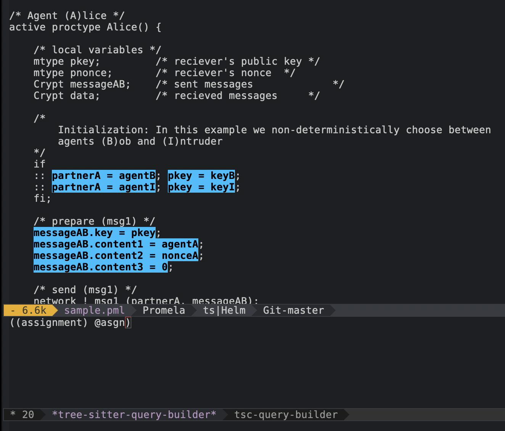

# tree-sitter-promela
Promela grammar for
[tree-sitter](https://github.com/tree-sitter/tree-sitter).



## Motivation
[Promela](https://en.wikipedia.org/wiki/Promela) is a language used
for specifying models, especially in distributed systems contexts.
However, the tooling behind it is underdeveloped—existing highlighting
for the language are often regex-based and not suitable for reuse in
other tools such as linters and formatters.  Having a tree-sitter
grammar for the language would provide a reusable foundation for
building, especially since tree-sitter [provides bindings
in other languages](https://tree-sitter.github.io/tree-sitter/#language-bindings).

## Current status
Most of the grammar has been implemented, I'm currently parsing
example source code and fixing incorrect parses.

## Building
```ShellSession
$ npm run build && tree-sitter test
```

## Contributing
You don't need to know JavaScript or specific details about
tree-sitter to help out!  Try running the parser on real Promela
programs and open an issue if the parser failed where it should be
succeeding.


## References
The grammar is based on the [YACC grammar for Promela](https://github.com/nimble-code/Spin/blob/9ecb1af6d174532f3a77acae3a1d424fe7345a3e/Src/spin.y).
